# 問い合わせ → 契約 → 施工 一気通貫フロー設計

> 株式会社ラポルタ（内装工事・店舗・リノベーション）
> 作成日: 2026-04-01

---

## 全体概要

新規問い合わせの受付から完工・アフターフォローまでの8フェーズを、
LINE CRM / Discord / 見積AI / Gemini画像生成を連携させて自動化する。

**設計思想**: ブティック型の内装会社として「人の温かみ」を保ちつつ、
繰り返し作業・事務処理・進捗報告は徹底的に自動化する。

---

## フロー全体図（Mermaid）

```mermaid
flowchart TD
    subgraph Phase1["Phase 1: 問い合わせ受付"]
        HP["HP お問い合わせフォーム<br/>laporta-hp/contact"]
        LINE["LINE 友だち追加<br/>+ トーク問い合わせ"]
        HP -->|Resend → Discord通知| D_HP["#laporta-hp"]
        LINE -->|Webhook → D1登録| D_LINE["#line-crm"]
        D_HP --> CRM["LINE CRM D1<br/>リード登録"]
        D_LINE --> CRM
    end

    subgraph Phase2["Phase 2: ヒアリング"]
        CRM -->|自動テンプレ送信| HEARING["ヒアリングシート<br/>(LIFF フォーム)"]
        HEARING -->|回答 → D1保存| HEAR_DATA["ヒアリングデータ<br/>工事種別/場所/寸法/予算/時期"]
    end

    subgraph Phase3["Phase 3: 概算見積"]
        HEAR_DATA -->|NLパーサー投入| EST["#見積・積算<br/>見積AI"]
        EST -->|cost-master.json参照| EST_DOC["見積書PDF生成"]
        EST_DOC -->|LINE送信 + Discord共有| CLIENT3["施主に概算提示"]
    end

    subgraph Phase4["Phase 4: 施工イメージ生成"]
        CLIENT3 -->|現場写真 + 要望テキスト| IMG_GEN["Gemini Nano/Banana<br/>画像生成"]
        IMG_GEN -->|生成画像| IMG_REVIEW["施主に画像送付<br/>(LINE Flex Message)"]
    end

    subgraph Phase5["Phase 5: すり合わせ"]
        IMG_REVIEW -->|修正依頼| ADJUST["イメージ修正<br/>見積調整"]
        ADJUST -->|再生成 / 手動修正| IMG_REVIEW
        ADJUST -->|確定| FINAL["最終見積 + 最終イメージ確定"]
    end

    subgraph Phase6["Phase 6: 契約"]
        FINAL -->|契約書テンプレ生成| CONTRACT["契約書<br/>(電子署名 or 書面)"]
        CONTRACT -->|入金確認| START["着工準備"]
    end

    subgraph Phase7["Phase 7: 施工管理"]
        START -->|工程表自動生成| SCHEDULE["工程管理<br/>GCal連携"]
        SCHEDULE -->|日次進捗| D_REPORT["#現場写真・日報"]
        D_REPORT -->|写真+テキスト → LINE転送| CLIENT7["施主に進捗報告"]
    end

    subgraph Phase8["Phase 8: 完工・アフター"]
        CLIENT7 -->|完工| DONE["完工写真撮影<br/>引渡し"]
        DONE -->|自動フォロー| AFTER["アフターフォロー<br/>LINE ステップ配信"]
        AFTER -->|1w/1m/3m/6m| REVIEW_REQ["口コミ依頼<br/>メンテ案内"]
    end

    style Phase1 fill:#e8f4fd,stroke:#1e88e5
    style Phase2 fill:#fff3e0,stroke:#fb8c00
    style Phase3 fill:#e8f5e9,stroke:#43a047
    style Phase4 fill:#f3e5f5,stroke:#8e24aa
    style Phase5 fill:#fce4ec,stroke:#e53935
    style Phase6 fill:#e0f2f1,stroke:#00897b
    style Phase7 fill:#fff8e1,stroke:#f9a825
    style Phase8 fill:#efebe9,stroke:#6d4c41
```



---

## Phase 1: 問い合わせ受付

| 項目 | 内容 |
|------|------|
| **チャネル** | HP (`/contact`) / LINE公式アカウント |
| **Discordチャンネル** | #laporta-hp (1488483267182071809) / #line-crm (1488483269107257418) |
| **自動化レベル** | フル自動 |
| **目標レスポンス** | 3分以内に自動初回応答 |

### データフロー

```
[HP フォーム送信]
  → Next.js API Route (/api/contact)
  → Resend メール → niiyama@laporta.co.jp
  → Discord #laporta-hp に Webhook 通知（新規リード情報）
  → LINE CRM D1 に friends レコード作成（タグ: "HP問い合わせ"）

[LINE 友だち追加 / トーク]
  → CF Workers Webhook → D1 に friend 自動登録
  → Discord #line-crm に通知
  → 自動応答: 「お問い合わせありがとうございます。担当よりご連絡いたします。」
  → ステップ配信シナリオ "新規問い合わせ" 開始
```

### 自動初回応答テンプレート（LINE）

```
{name}様、株式会社ラポルタにお問い合わせいただきありがとうございます。

{category_greeting}

まずは簡単なヒアリングシートにご記入いただけますでしょうか。
3分ほどで完了します。

▼ ヒアリングシート
{LIFF_FORM_URL}

ご記入後、担当の新山より2営業日以内にご連絡いたします。
お急ぎの場合はこのLINEで直接ご相談ください。
```

#### カテゴリ別パーソナライズ（{category_greeting}）

| 問い合わせ種別 | greeting文 |
|----------------|------------|
| 店舗内装 | 「店舗の内装工事のご相談ですね！どんなお店のイメージをお持ちですか？お写真があればぜひお送りください。」 |
| オフィス | 「オフィスの内装工事、承りました。働きやすい空間づくり、一緒に考えましょう。」 |
| 住宅リノベ | 「住まいのリノベーションのご相談ですね。理想の暮らしをお聞かせください。」 |
| 原状回復 | 「原状回復工事のご相談を承りました。物件の状況に合わせて最適なプランをご提案いたします。」 |
| デフォルト | 「内装・リノベーションのご相談を承りました。」 |

> **設計意図**: 初回自動応答の段階から「あなたのことを理解している」印象を与え、
> ブティック型サービスのパーソナル感を演出する。

### 必要なインテグレーション

| 連携元 | 連携先 | 方法 | 状態 |
|--------|--------|------|------|
| HP contact API | Discord #laporta-hp | Discord Webhook | **要実装** |
| HP contact API | LINE CRM | REST API (POST /friends) | **要実装** |
| LINE Webhook | D1 | CF Workers (既存) | **実装済み** |
| LINE Webhook | Discord #line-crm | Discord Webhook | **要実装** |

---

## Phase 2: ヒアリング

| 項目 | 内容 |
|------|------|
| **チャネル** | LINE (LIFF フォーム) |
| **Discordチャンネル** | #line-crm |
| **自動化レベル** | セミオート（フォーム自動送信 → 回答は施主） |

### ヒアリング項目

| # | 項目 | 型 | 例 |
|---|------|----|----|
| 1 | 工事種別 | セレクト | 店舗内装/オフィス/住宅リノベ/原状回復 |
| 2 | 物件種別 | セレクト | テナント/戸建て/マンション/ビルフロア |
| 3 | 所在地 | テキスト | 東京都渋谷区... |
| 4 | 面積（坪/m2） | 数値 | 30坪 |
| 5 | 希望工事内容 | テキストエリア | 壁紙張替え、床CF張り、照明交換... |
| 6 | 参考イメージ | 画像アップロード | 施工後のイメージ写真 |
| 7 | 予算感 | セレクト | 〜50万/50-100万/100-300万/300万〜/未定 |
| 8 | 希望時期 | セレクト | 今月中/1-2ヶ月以内/3ヶ月以内/未定 |
| 9 | 図面有無 | ラジオ | あり（アップロード）/なし |
| 10 | 備考 | テキストエリア | 自由記述 |

### データフロー

```
[施主がLIFFフォーム入力]
  → D1 form_submissions テーブル保存
  → friend にタグ自動付与: "ヒアリング済み"
  → Discord #line-crm に回答サマリー通知
  → スコアリング: +20pt（ヒアリング完了）
  → 条件分岐:
    - 予算50万以上 & 時期1ヶ月以内 → タグ "ホットリード" → 即時通知
    - それ以外 → 通常フロー
  → ヒアリング完了後自動メッセージ:
    「ご記入ありがとうございます。内容を拝見しました。
     より詳しくお伺いするため、新山との個別相談（30分・無料）を
     ご予約いただけますか？」
    + GCal予約リンク（LIFF カレンダー連携）
```

### 個別相談予約の導線

> **設計意図**: フォームでは拾いきれない施主の潜在ニーズ・不安・こだわりを
> 早期にキャッチし、信頼関係を構築する。特にホットリードには必須。

```
[ヒアリング完了]
  → 自動メッセージで個別相談予約を提案
  → GCal連携 既存カレンダーUIで空き枠提示
  → 予約確定 → タグ "相談予約済み" → スコアリング +15pt
  → 前日リマインダー（LINE Push）
  → 相談実施後 → タグ "相談完了" → Phase 3 トリガー
```

### 必要なインテグレーション

| 連携 | 方法 | 状態 |
|------|------|------|
| ヒアリングLIFFフォーム定義 | LINE CRM Forms API | **要実装**（フォーム定義のみ） |
| 回答 → D1保存 | 既存 form_submissions | **実装済み** |
| 回答 → 自動タグ付与 | 既存 IF-THEN Automation | **実装済み** |
| ホットリード検知 → Discord通知 | Notification Rules | **実装済み** |

---

## Phase 3: 概算見積

| 項目 | 内容 |
|------|------|
| **チャネル** | Discord #見積・積算 (1488483262316941414) |
| **自動化レベル** | セミオート（AIが叩き台作成 → 新山さん確認 → 送付） |

### データフロー

```
[ヒアリングデータ取得]
  → 自然言語に整形:
    「渋谷区テナント30坪、壁紙張替え全面、床CF張り、照明LED交換20箇所、予算100万前後」
  → #見積・積算 に投稿（discord-estimate.ts NLパーサー）
  → cost-master.json (80品目×7カテゴリ) から単価参照
  → 自動計算:
    - 壁紙張替え: 30坪 × 天井高2.5m × 4面 → 約200m2 × @1,200 = ¥240,000
    - 床CF: 30坪 × 3.3m2 = 99m2 × @3,500 = ¥346,500
    - 照明LED: 20箇所 × @8,000 = ¥160,000
    - 諸経費 10% ...
  → 見積書フォーマット（Flex Message or PDF）生成
  → Discord で新山さんに確認提示
  → 承認後 → LINE で施主に送付
  → 送付時メッセージ:
    「{name}様、ヒアリング内容を元に概算お見積りを作成しました。
     こちらはAIによる迅速なファーストドラフトです。
     新山がお客様のご要望を踏まえ、プロの視点で精査しております。
     ご不明点があればお気軽にこのLINEでご質問ください。」
```

> **AI透明性ポリシー**: AIの役割を「効率化のための叩き台作成」として明示し、
> 最終品質は人が担保することを伝える。施主のAIへの漠然とした不安を解消しつつ、
> スピード感という価値を提供する。

### 見積書テンプレート構成

```
━━━━━━━━━━━━━━━━━━━━━━━━
概算お見積書
株式会社ラポルタ
━━━━━━━━━━━━━━━━━━━━━━━━
{施主名}様

件名: {物件名} 内装工事

| No | 項目 | 数量 | 単位 | 単価 | 金額 |
|----|------|------|------|------|------|
| 1  | 壁紙張替え | 200 | m2 | 1,200 | 240,000 |
| 2  | 床CF張り | 99 | m2 | 3,500 | 346,500 |
| ...                                          |

小計: ¥XXX,XXX
諸経費(10%): ¥XX,XXX
消費税(10%): ¥XX,XXX
合計: ¥XXX,XXX

※ 概算のため、現地調査後に正式見積をご提出します
有効期限: 発行日より30日間
━━━━━━━━━━━━━━━━━━━━━━━━
```

### 必要なインテグレーション

| 連携 | 方法 | 状態 |
|------|------|------|
| ヒアリング → NLテキスト整形 | カスタムロジック | **要実装** |
| NLパーサー見積計算 | discord-estimate.ts | **実装済み** |
| cost-master.json 参照 | 80品目×7カテゴリ | **実装済み（拡張中）** |
| 見積PDF生成 | Puppeteer or jsPDF | **要実装** |
| 見積 → LINE送信 | LINE CRM Flex Message | **実装済み（送信機構）** |
| 承認ワークフロー（Discord→LINE） | ボタンリアクション | **要実装** |

---

## Phase 4: 施工イメージ生成

| 項目 | 内容 |
|------|------|
| **チャネル** | Discord（内部生成）→ LINE（施主提示） |
| **自動化レベル** | セミオート（AI生成 → 新山さん選別 → 送付） |

### データフロー

```
[入力]
  - 現場写真（施主提供 or 現調時撮影）
  - ヒアリング内容（工事種別、素材、色味、テイスト）
  - 参考イメージ写真（あれば）

[画像生成]
  → 写真 + プロンプト → Gemini Nano/Banana API
  → プロンプト例:
    "Interior renovation of a 30-tsubo retail space in Shibuya.
     Replace wallpaper with white textured finish,
     install gray CF flooring, modern LED pendant lighting.
     Style: minimal Japanese contemporary."
  → 3-5パターン生成

[選別・送付]
  → Discord に生成画像投稿（内部確認用）
  → 新山さん選別 → 2-3枚を施主に送付
  → LINE Flex Message（カルーセル形式）で提示
```

### Gemini 画像生成プロンプトテンプレート

```
Base: "Professional interior design visualization, photorealistic rendering"
Space: "{工事種別} in {所在地}, {面積}坪"
Materials: "{壁材}, {床材}, {天井仕上}"
Style: "{テイスト} style, {色味} color palette"
Lighting: "{照明タイプ}"
Angle: "eye-level perspective, wide-angle interior shot"
Quality: "8K quality, natural lighting, magazine-worthy"
```

### 必要なインテグレーション

| 連携 | 方法 | 状態 |
|------|------|------|
| Gemini画像生成API | REST API呼び出し | **要実装** |
| 画像一時保存 | R2 or S3 | **要実装** |
| Discord投稿（内部確認） | Discord Webhook | **要実装** |
| LINE画像送信 | LINE Messaging API (image) | **実装済み（送信機構）** |
| カルーセルFlex Message | 既存Flex builder | **実装済み** |

---

## Phase 5: すり合わせ・修正

| 項目 | 内容 |
|------|------|
| **チャネル** | LINE（施主対応）/ Discord（内部調整） |
| **自動化レベル** | 手動主体（対話ベース、AIはアシスト） |

### データフロー

```
[施主フィードバック]
  → LINE トーク: 「もう少し暖色系にしたい」「床はもっと明るい色で」
  → Discord #line-crm に転送
  → 修正依頼を整理:
    1. イメージ修正 → Phase 4 に戻って再生成
    2. 見積修正 → Phase 3 に戻って再計算
    3. 仕様変更 → ヒアリングデータ更新

[収束条件]
  → 施主「これでお願いします」
  → タグ付与: "イメージ確定"
  → スコアリング: +30pt
  → Phase 6 トリガー
```

### 必要なインテグレーション

| 連携 | 方法 | 状態 |
|------|------|------|
| LINE ↔ Discord メッセージ同期 | Operator Chat + Discord転送 | **一部実装済み** |
| フィードバック → 再生成トリガー | 手動（将来はAI判定） | **手動運用** |

---

## Phase 6: 契約

| 項目 | 内容 |
|------|------|
| **チャネル** | LINE / メール / 対面 |
| **Discordチャンネル** | #line-crm |
| **自動化レベル** | セミオート（書類自動生成 → 署名は手動） |

### データフロー

```
[契約準備]
  → 最終見積データから契約書テンプレート生成
  → 契約書フィールド:
    - 工事名称、工事場所、工期
    - 請負金額（税込）
    - 支払条件（着手金/中間金/完工金の割合）
    - 瑕疵担保責任期間
    - 反社会的勢力排除条項
  → PDF生成 → 施主に送付

[署名方法]
  Option A: 電子署名（CloudSign / DocuSign連携）
  Option B: PDF送付 → 対面/郵送で捺印
  Option C: LINE上で同意ボタン（簡易契約向け）

[入金フロー]
  → Stripe 請求書発行 or 銀行振込案内
  → 入金確認 → タグ: "契約済み" / "入金済み"
  → Discord #line-crm に通知
  → Phase 7 トリガー
```

### 契約書テンプレート構成

```
工事請負契約書

1. 工事名: {件名}
2. 工事場所: {住所}
3. 工期: {着工日} 〜 {完工予定日}
4. 請負金額: ¥{金額}（税込¥{税込金額}）
5. 支払条件:
   - 着手金 {X}%: ¥{金額} （契約時）
   - 中間金 {Y}%: ¥{金額} （中間検査時）
   - 完工金 {Z}%: ¥{金額} （引渡し時）
6. 瑕疵担保: 引渡しより{N}年
```

### 必要なインテグレーション

| 連携 | 方法 | 状態 |
|------|------|------|
| 契約書PDF生成 | テンプレートエンジン + jsPDF | **要実装** |
| 電子署名 | CloudSign API or DocuSign | **要検討** |
| Stripe請求 | LINE CRM Stripe連携 | **実装済み（APIキー設定待ち）** |
| 入金確認 → タグ自動付与 | Stripe Webhook → IF-THEN | **要実装** |

---

## Phase 7: 施工管理

| 項目 | 内容 |
|------|------|
| **チャネル** | Discord #現場写真・日報 (1488483264002920508) / Google Calendar |
| **自動化レベル** | セミオート（工程自動生成、日報は現場から手動投稿 → 自動転送） |

### データフロー

```
[着工準備]
  → 見積明細から工程表を自動生成:
    Day 1-2: 養生・撤去
    Day 3-5: 下地処理
    Day 6-8: 壁紙施工
    Day 9-10: 床CF施工
    Day 11: 照明器具取付
    Day 12: クリーニング・検査
    Day 13: 引渡し
  → Google Calendar に予定登録（GCal連携 既存）
  → 施主にLINEで工程表送付

[日次進捗]
  → 現場スタッフ → Discord #現場写真・日報 に写真+コメント投稿
  → 自動処理:
    1. 投稿内容を整形
    2. LINE で施主に日報送信（写真+進捗テキスト）
    3. 工程表の進捗率更新
  → 週次サマリーも自動生成

[施主への進捗報告テンプレート（LINE）]
  {施主名}様

  本日の工事進捗をご報告いたします。

  📍 {物件名}
  📅 {日付}（工期 {N}日目/{全体}日）
  ✅ 本日の作業: {作業内容}
  📸 {写真}

  進捗率: {X}%
  ■■■■■■□□□□ {X}%

  次の工程: {次の作業}
```

### 工程テンプレート（工事種別ごと）

| 工事種別 | 標準工期 | 主要工程 |
|----------|----------|----------|
| 壁紙張替え | 2-5日 | 養生→撤去→下地→施工→清掃 |
| 床張替え | 3-7日 | 養生→撤去→下地→施工→清掃 |
| 店舗内装（小） | 2-3週 | 解体→設備→造作→仕上→設備取付→清掃 |
| 店舗内装（大） | 1-2ヶ月 | 解体→構造→設備→造作→仕上→設備取付→検査→清掃 |
| 住宅リノベ | 1-3ヶ月 | 解体→構造補強→設備→断熱→造作→仕上→設備取付→検査 |
| 原状回復 | 1-5日 | 撤去→補修→塗装/張替→清掃 |

### 必要なインテグレーション

| 連携 | 方法 | 状態 |
|------|------|------|
| 見積 → 工程表自動生成 | カスタムロジック（品目→工程マッピング） | **要実装** |
| 工程 → GCal登録 | LINE CRM GCal連携 | **実装済み** |
| Discord日報 → LINE転送 | Discord Bot → LINE Push | **要実装** |
| 進捗率自動計算 | 工程チェックリスト | **要実装** |

---

## Phase 8: 完工・アフターフォロー

| 項目 | 内容 |
|------|------|
| **チャネル** | LINE（自動ステップ配信） |
| **自動化レベル** | フル自動（ステップ配信シナリオ） |

### データフロー

```
[完工]
  → 完工写真撮影 → Discord #現場写真・日報 に投稿
  → 施主にLINEで完工報告（Before/After写真）
  → タグ: "完工済み"
  → 完工ステップ配信シナリオ起動

[アフターフォロー ステップ配信]
  Day 0:  完工お礼メッセージ + Before/After写真
  Day 7:  「お住まい(店舗)の調子はいかがですか？」
  Day 30: 「1ヶ月点検のご案内」+ 簡易アンケート
  Day 60: Google口コミ依頼（満足度高い場合のみ）
  Day 90: 「3ヶ月メンテナンスのご案内」
  Day 180: 「半年点検 + 追加工事のご相談承ります」

[口コミ導線]
  → Day 30 アンケートで満足度回答
  → 満足度4-5 → 「Googleに口コミいただけると嬉しいです」+ リンク
  → 満足度1-3 → 社内通知 → 新山さんが直接フォロー

[リピート施策]
  → 完工顧客にタグ: "既存顧客"
  → 季節キャンペーン配信対象に追加
  → 紹介割引案内（紹介者にも特典）
```

### 必要なインテグレーション

| 連携 | 方法 | 状態 |
|------|------|------|
| ステップ配信シナリオ | LINE CRM Scenarios API | **実装済み** |
| アンケートLIFFフォーム | LINE CRM Forms | **実装済み** |
| 満足度 → 条件分岐 | IF-THEN Automation | **実装済み** |
| Google口コミURL送信 | LINE Push (URL) | **実装済み（送信機構）** |

---

## 実装状況サマリー

### 実装済み（そのまま使える）

| コンポーネント | 場所 | 備考 |
|----------------|------|------|
| LINE Webhook → D1 自動登録 | line-harness-oss/apps/worker | 友だち追加で即登録 |
| ステップ配信 (Cron) | line-harness-oss/apps/worker | 5分毎チェック |
| IF-THEN Automation | line-harness-oss/apps/worker | 条件→自動アクション |
| スコアリング | line-harness-oss/apps/worker | ルールベース自動加算 |
| Flex Message送信 | line-harness-oss/packages/line-sdk | カルーセル・カード・画像 |
| フォーム (LIFF) | line-harness-oss/apps/liff | 回答→D1保存→タグ付与 |
| GCal連携 | line-harness-oss/apps/worker | 予約/工程登録 |
| 見積AI NLパーサー | discord-estimate.ts | 自然言語→見積変換 |
| cost-master.json | 80品目×7カテゴリ | 単価マスタ |
| HP問い合わせフォーム | laporta-hp/src/app/contact | Resendメール通知 |
| Notification Rules | line-harness-oss/apps/worker | イベント駆動通知 |
| Stripe連携 (基盤) | line-harness-oss/apps/worker | テーブル/ルート済、API鍵待ち |

### 要実装（新規開発）

| # | コンポーネント | 工数見積 | 優先度 | 依存関係 |
|---|----------------|----------|--------|----------|
| 1 | HP問い合わせ → Discord Webhook通知 | 0.5日 | **高** | なし |
| 2 | HP問い合わせ → LINE CRM リード登録API連携 | 1日 | **高** | LINE CRM API |
| 3 | LINE → Discord #line-crm 転送Bot | 1日 | **高** | Discord Bot |
| 4 | ヒアリングLIFFフォーム定義（10項目） | 0.5日 | **高** | 既存Forms API |
| 5 | ヒアリング → NLテキスト整形ロジック | 1日 | **中** | #4 |
| 6 | 見積書PDF生成 | 2日 | **中** | jsPDF or Puppeteer |
| 7 | 見積承認ワークフロー（Discord→LINE送付） | 1日 | **中** | Discord Bot |
| 8 | Gemini画像生成API連携 | 2日 | **高** | Gemini API key |
| 9 | 画像一時保存（R2） | 0.5日 | **高** | #8 |
| 10 | 画像選別→LINE送付ワークフロー | 1日 | **中** | #8, #9 |
| 11 | 契約書PDFテンプレート生成 | 2日 | **低** | #6の知見流用 |
| 12 | 電子署名連携（CloudSign/DocuSign） | 3日 | **低** | 要契約 |
| 13 | 見積→工程表自動生成 | 2日 | **中** | 工程テンプレートDB |
| 14 | Discord日報 → LINE自動転送 | 1日 | **高** | Discord Bot |
| 15 | 進捗率自動計算 + 報告テンプレート | 1日 | **中** | #13 |
| 16 | 完工アフターフォロー ステップ配信シナリオ定義 | 0.5日 | **中** | 既存Scenarios API |
| 17 | Stripe APIキー設定 + 請求書発行フロー | 1日 | **中** | Stripe契約 |

### 工数まとめ

| 優先度 | 項目数 | 合計工数 |
|--------|--------|----------|
| **高**（すぐやる） | #1,2,3,4,8,9,14 | **約7日** |
| **中**（次フェーズ） | #5,6,7,10,13,15,16,17 | **約10日** |
| **低**（余裕があれば） | #11,12 | **約5日** |
| **合計** | 17項目 | **約22日** |

---

## 推奨実装順序

### Sprint 1（1週間）: 受付〜ヒアリング自動化

1. HP問い合わせ → Discord通知 + CRM登録 (#1, #2)
2. LINE ↔ Discord メッセージ転送 (#3)
3. ヒアリングLIFFフォーム作成 (#4)

**効果**: 問い合わせの取りこぼしゼロ、初回応答3分以内を実現

### Sprint 2（1週間）: 見積〜イメージ生成

4. Gemini画像生成API連携 + R2保存 (#8, #9)
5. ヒアリング → 見積NLテキスト変換 (#5)
6. 見積承認 → LINE送付フロー (#7)

**効果**: 「問い合わせ → 概算見積+施工イメージ」を即日提供可能に

### Sprint 3（1週間）: 施工管理〜アフター

7. Discord日報 → LINE転送 (#14)
8. 工程表自動生成 (#13, #15)
9. アフターフォロー配信シナリオ (#16)
10. 見積PDF生成 (#6)

**効果**: 施工中の顧客体験向上、完工後のリピート導線確立

### Sprint 4（以降）: 契約・決済

11. 契約書PDF + 電子署名 (#11, #12)
12. Stripe請求フロー (#17)
13. 画像選別ワークフロー高度化 (#10)

---

## KPI（効果測定指標）

| 指標 | 現状（推定） | 目標 | 測定方法 |
|------|-------------|------|----------|
| 初回応答時間 | 数時間〜翌日 | 3分以内（自動） | LINE CRM タイムスタンプ |
| 見積提出リードタイム | 3-5日 | 即日（概算） | Discord投稿→LINE送信 差分 |
| イメージ提供有無 | なし | 100%提供 | Gemini生成ログ |
| 施工中の進捗共有頻度 | 不定期 | 毎日（自動） | Discord #日報 投稿数 |
| 完工後フォロー率 | 手動（属人） | 100%（自動） | ステップ配信完了率 |
| Google口コミ獲得 | 不定 | 完工案件の30%+ | LINE CRM CVトラッキング |
| リピート・紹介率 | 不明 | 計測開始 | タグ "紹介" / "リピート" |

---

## 技術アーキテクチャ全体図

```
┌─────────────────────────────────────────────────────────────┐
│                      施主（エンドユーザー）                    │
│                   LINE / HP / 電話 / 対面                    │
└───────┬────────────────────────┬────────────────────────┬────┘
        │                        │                        │
        ▼                        ▼                        ▼
┌───────────────┐  ┌───────────────────┐  ┌──────────────────┐
│ ラポルタ HP    │  │ LINE Official     │  │ Google Calendar  │
│ (Next.js/     │  │ Account           │  │                  │
│  Vercel)      │  │                   │  │                  │
└───────┬───────┘  └─────────┬─────────┘  └────────┬─────────┘
        │                    │                      │
        ▼                    ▼                      │
┌───────────────────────────────────────────┐       │
│         LINE Harness (CF Workers)         │       │
│  ┌─────────┐ ┌──────────┐ ┌───────────┐  │       │
│  │ Webhook │ │ REST API │ │ Cron Jobs │  │◄──────┘
│  │ Handler │ │ (Hono)   │ │ (Step/    │  │
│  │         │ │          │ │  Remind)  │  │
│  └────┬────┘ └────┬─────┘ └─────┬─────┘  │
│       │           │             │         │
│       ▼           ▼             ▼         │
│  ┌────────────────────────────────────┐   │
│  │           Cloudflare D1            │   │
│  │  friends | forms | scenarios |     │   │
│  │  estimates | automations | ...     │   │
│  └────────────────────────────────────┘   │
└───────────────┬───────────────────────────┘
                │
                ▼
┌───────────────────────────────────────────┐
│            Discord (内部オペレーション)      │
│                                           │
│  #見積・積算     → 見積AI NLパーサー        │
│  #現場写真・日報  → 施工進捗管理             │
│  #line-crm      → LINE CRM通知            │
│  #laporta-hp    → HP問い合わせ通知          │
└───────────────┬───────────────────────────┘
                │
                ▼
┌───────────────────────────────────────────┐
│            外部サービス連携                  │
│                                           │
│  Gemini Nano/Banana  → 施工イメージ生成     │
│  Cloudflare R2       → 画像ストレージ       │
│  Resend              → メール通知           │
│  Stripe              → 決済・請求           │
│  CloudSign           → 電子署名（将来）     │
└───────────────────────────────────────────┘
```

---

## 運用上の注意

### 人が介在すべきポイント（自動化しない）

1. **最終見積の承認** — AIの概算を新山さんが必ず確認してから施主に送る
2. **施工イメージの選別** — AI生成画像を新山さんが品質チェックしてから送る
3. **契約内容の確認** — 法的書類は必ず人が最終確認
4. **クレーム・トラブル対応** — 自動応答せず即座に新山さんに通知
5. **大型案件（300万超）の価格交渉** — AI見積はあくまで叩き台

### 自動化で効くポイント

1. **初回応答の速さ** — 3分以内の自動返信で信頼獲得
2. **ヒアリングの漏れ防止** — フォームで必須項目を確実に取得
3. **見積の叩き台作成** — 手作業30分→AI5秒
4. **日報の施主共有** — Discord投稿するだけでLINEに自動転送
5. **アフターフォロー** — 忘れがちなフォローを100%自動実行

---

## 将来拡張: 施主向けマイページ（LIFFポータル）

> **DXコンサル提案**: 施主が自分の案件状況をいつでも確認できるポータルを
> LIFF拡張で提供する。個別の「今どうなってますか？」問い合わせを削減しつつ、
> 情報の透明性で信頼を獲得する。

### 表示項目

| セクション | 内容 | データソース |
|-----------|------|-------------|
| 進捗状況 | 現在のフェーズ + 工程表 | friend tags + GCal |
| 見積書 | 承認済み見積PDF | D1 estimates |
| 施工イメージ | 確定画像 | R2 |
| 日報写真 | これまでの進捗写真一覧 | Discord #日報 → R2 |
| 書類 | 契約書・請求書 | D1 + Stripe |
| 支払い | 入金状況 | Stripe |

### 実装アプローチ

- 既存LIFFアプリを拡張（`apps/liff/src/portal.ts`）
- LINE認証でfriend_idを取得、自分の案件のみ表示
- 工数見積: 3-5日（Phase 7,8 完了後）

---

## AI品質フィードバックループ

> **継続改善**: 見積AI・画像生成AIの精度を運用しながら継続的に向上させる仕組み。

### フィードバック収集方法

```
[見積AIフィードバック]
  → 新山さんがAI見積を修正 → 修正箇所をDiscordリアクションでタグ付け
    💰 = 単価修正
    📐 = 数量修正
    ➕ = 項目追加
    ➖ = 項目削除
  → 修正ログ → feedback_log テーブル（新規）
  → 月次で修正傾向を分析 → cost-master.json 自動更新提案

[画像生成フィードバック]
  → 新山さんが選別した画像に ✅ / ❌ リアクション
  → 選別ログ → プロンプトテンプレートの改善に活用
  → 顧客の最終選択も記録 → 好まれるスタイル傾向を蓄積
```

### 必要なインテグレーション

| 連携 | 方法 | 優先度 |
|------|------|--------|
| Discord リアクション → feedback_log | Discord Bot | **中** |
| feedback_log → 月次分析レポート | Cron + Gemini分析 | **低** |
| 分析結果 → cost-master.json 更新提案 | Discord #見積・積算 に投稿 | **低** |
